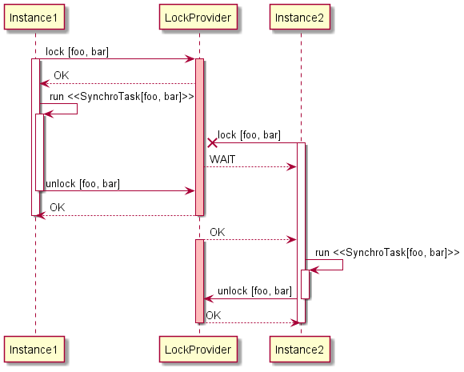
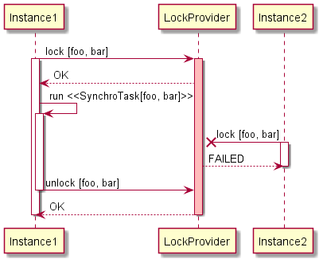
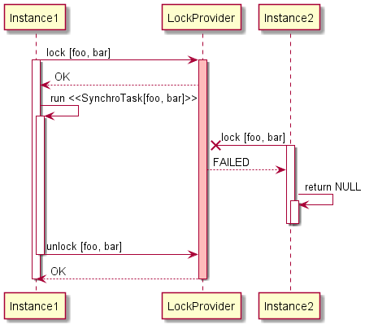

# SynchroTask

[](https://www.apache.org/licenses/LICENSE-2.0.txt)
[](https://maven-badges.herokuapp.com/maven-central/org.vg2902/synchro-task-parent)
[](https://javadoc.io/doc/org.vg2902/synchro-task-parent)

SynchroTask is a lightweight library which helps to synchronize Java routines in distributed environments.

Synchronization is one of the most important parts in software development. 
Programming languages offer a wide range of options to work with locks and concurrency.
In Java, developers can choose between low-level features, such as **synchronized** or methods like Object.wait(), 
and high-level abstractions from **java.util.concurrent.locks**.
However, when it comes to multi-instance environments, these mechanisms are not sufficient.

Sharing locks between different Java virtual machines requires an external agent, 
and **SynchroTask** library is one of those agents.

* [Concepts](#concepts)
  * [SynchroTask](#synchrotask)
  * [Collision strategy](#collision-strategy)
  * [SynchroTaskService](#synchrotaskservice)
* [Providers](#providers)
  * [JDBC](#jdbc)
* [Spring integration](#spring-integration)
* [Logging](#logging)
* [Release notes](#release-notes)
  * [0.2.0](#020)
  * [0.1.0](#010)

## Concepts
The library does not implement any lock primitives on its own. 
Instead, it relies on external lock providers and helps to seamlessly integrate them into your code.  

There are two key abstractions:
* [SynchroTask](synchro-task-core/src/main/java/org/vg2902/synchrotask/core/api/SynchroTask.java) - represents a unit of work which requires synchronization while executing
* [SynchroTaskService](synchro-task-core/src/main/java/org/vg2902/synchrotask/core/api/SynchroTaskService.java) - a service for running `SynchroTask` instances

#### SynchroTask
A **SynchroTask** is uniquely identified by a combination of **taskName** and **taskId**.

Once initiated and until completed, a **SynchroTask** instance will prevent other instances
with the same **taskName** and **taskId** from being launched in parallel. 
An attempt to start such an instance will cause a [**collision**](#collision-strategy) 
and will be rejected. 
In other words, **SynchroTask** instance **acquires**/**releases** a **lock** upon start/completion respectively.

The workload is provided in the form of `Supplier`, or `Runnable` for the tasks with no return value.

Use builder methods to construct `SynchroTask` objects:

```java
import org.vg2902.synchrotask.core.SynchroTask;

...

SynchroTask<String> synchroTaskFromSupplier = SynchroTask
        .from(() -> "foo")
        .withName("bar")
        .withId(42)
        .build();

SynchroTask<Void> synchroTaskFromRunnable = SynchroTask
        .from(() -> System.out.println("foo"))
        .withName("bar")
        .withId(42)
        .build();
```

Technically, **taskName** and **taskId** don't bear any special meaning, and both are treated by the framework just as parts of a composite unique key.   
How you define them is a matter of your naming convention, however, the general guideline is to use **taskName** to designate 
a group of similar tasks, and **taskId** to distinguish individual instances within a group. Here are some examples: 

taskName | taskId
------------ | -------------
"tableExport" | "ORDERS_20201229"
"tableExport" | "ORDERS_20201230"
"tableExport" | "INVENTORY_20201231"
"emailSender" | "20201231 1800"
"emailSender" | "20201231 1900"
"emailSender" | "20201231 2000"
"editDocument" | "attachment2.docx"
"editDocument" | "attachment3.xlsx"

Although **taskName** and **taskId** can be objects of any type, all `SynchroTaskService` implementations 
will internally convert them into `String` using `String.valueOf(Object)`. 
These `String` representations will be actually passed into external lock providers.

#### Collision strategy
You can control how `SynchroTask` behaves in case of **collisions**, i.e., when a task cannot start because 
another `SynchroTask` instance with the same **taskName** and **taskId** is already executing.

There are three possible options defined in [CollisionStrategy](synchro-task-core/src/main/java/org/vg2902/synchrotask/core/api/CollisionStrategy.java) enum:
##### WAIT
`SynchroTask` will wait until the blocking instance completes:



Waiting task example:

```java
import org.vg2902.synchrotask.core.SynchroTask;

...

SynchroTask<String> waitingTask = SynchroTask
        .from(() -> "foo")
        .withName("bar")
        .withId(42)
        .onLock(CollisionStrategy.WAIT);
        .build();
```

##### THROW
`SynchroTask` will throw [SynchroTaskCollisionException](synchro-task-core/src/main/java/org/vg2902/synchrotask/core/exception/SynchroTaskCollisionException.java):



Throwing task example:

```java
import org.vg2902.synchrotask.core.SynchroTask;

...

SynchroTask<String> throwingTask = SynchroTask
        .from(() -> "foo")
        .withName("bar")
        .withId(42)
        .onLock(CollisionStrategy.THROW);
        .build();
```

##### RETURN
`SynchroTask` will return **null** without actually executing:



Returning task example:

```java
import org.vg2902.synchrotask.core.SynchroTask;

...

SynchroTask<String> returningTask = SynchroTask
        .from(() -> "foo")
        .withName("bar")
        .withId(42)
        .onLock(CollisionStrategy.RETURN);
        .build();
```

If not specified explicitly during initialization, it is defaulted to `CollisionStrategy.WAIT`.

#### SynchroTaskService
After creating a `SynchroTask` object, you need to pass it to a `SynchroTaskService`.
The service has a `run()` method, which executes a given task with respect to its [CollisionStrategy](#collision-strategy).

Check [Providers](#providers) section for the available `SynchroTaskService` implementations.

## Providers
### JDBC
`SynchroTaskJdbcService` uses a special **registry table** in a database to keep track of running tasks 
and ensure synchronization. 
You can use the SQL below to create it:

#### H2
```iso92-sql
CREATE TABLE synchro_task(
  task_name         VARCHAR2(100 CHAR) NOT NULL
, task_id           VARCHAR2(100 CHAR) NOT NULL
, creation_time     TIMESTAMP(9)
, CONSTRAINT synchro_task_pk PRIMARY KEY (task_name, task_id));
```

#### PostgreSQL
```iso92-sql
CREATE TABLE synchro_task(
  task_name         VARCHAR(100) NOT NULL
, task_id           VARCHAR(100) NOT NULL
, creation_time     TIMESTAMP(6)
, CONSTRAINT synchro_task_pk PRIMARY KEY (task_name, task_id));
```

#### Oracle
```iso92-sql
CREATE TABLE synchro_task(
  task_name         VARCHAR2(100 CHAR) NOT NULL
, task_id           VARCHAR2(100 CHAR) NOT NULL
, creation_time     TIMESTAMP(9)
, CONSTRAINT synchro_task_pk PRIMARY KEY (task_name, task_id));
```

The table must have:
* all three columns with exactly the same names and data types as they are defined above
* a composite primary key based on **task_name** and **task_id** 

Column size, however, is not limited and can vary. Just make sure that **task_name** and **task_id** columns 
are wide enough to fit anticipated values. By default, the service expects the table to be named **SYNCHRO_TASK**, 
but it can be overridden during initialization.

`SynchroTaskJdbcService` requires `javax.sql.DataSource` for initialization. 
Every invocation of `run(SynchroTask)` method first will obtain a new `Connection` from this `DataSource`. 
This connection is then used to create and immediately lock the **control row** with the given **task_name** 
and **task_id** in the **registry table**. 

If the row already exists and is unlocked, the service will try to reuse it. 
If the row already exists and is locked by another database session, the given `SynchroTask` will be assumed 
as being currently executed, and the operation outcome will depend on the task's [CollisionStrategy](#collision-strategy).

After successful `SynchroTask` completion, the **control row** will be removed from the table, 
and the task result will be returned.

The `Connection` will always be closed before returning from the method.

#### Project dependency
```xml
<dependency>
    <groupId>org.vg2902</groupId>
    <artifactId>synchro-task-jdbc</artifactId>
    <version>0.2.0</version>
</dependency>
```

#### Usage

```java
import org.vg2902.synchrotask.core.api.SynchroTask;
import org.vg2902.synchrotask.core.api.SynchroTaskService;
import org.vg2902.synchrotask.jdbc.SynchroTaskJdbcService;

import javax.sql.DataSource;

...

DataSource ds = getDataSource();

SynchroTaskService service = SynchroTaskJdbcService
        .from(ds)
        .build;

SynchroTask<Void> noop = SynchroTask
        .from(() -> {})
        .withId("foo")
        .withName("bar")
        .build();

service.run(noop);
```

When creating a `SynchroTaskJdbcService`, you can provide two optional parameters:
* registry table name, defaults to **SYNCHRO_TASK** if not provided
* interceptor, which gets triggered as part of `SynchroTaskJdbcService.run(SynchroTask)` invocations,
  capturing the `SynchroTask` passed in, and `java.sql.Connection` object allocated for it.
  Interceptor is helpful mostly for testing and debugging purposes.
  
```java
import org.vg2902.synchrotask.core.api.SynchroTask;
import org.vg2902.synchrotask.core.api.SynchroTaskService;
import org.vg2902.synchrotask.jdbc.SynchroTaskJdbcService;

import javax.sql.DataSource;
import java.sql.Connection;

...

public void test(DataSource ds) {    
    SynchroTaskService service = SynchroTaskJdbcService
        .from(ds)
        .withTableName("CUSTOM_SYNCHRO_TASK")
        .withInterceptor(this::intercept)
        .build();

    SynchroTask<Void> noop = SynchroTask
        .from(() -> {})
        .withId("foo")
        .withName("bar")
        .build();
    
    service.run(noop);    
}

public void intercept(SynchroTask<?> task, Connection connection) {
    // do something
}
```

#### Requirements
The following databases are currently supported:
* H2
* PostgreSQL
* Oracle

## Spring integration
With SynchroTask Spring extension, you don't need to construct your tasks manually - just tell Spring which methods should be running as 
<b>SynchroTask</b>s, and the framework will do it for you.

#### Project dependency
```xml
<dependency>
    <groupId>org.vg2902</groupId>
    <artifactId>synchro-task-spring</artifactId>
    <version>0.2.0</version>
</dependency>
```

#### Usage
Spring setup requires two steps:
* enable **SynchroTask** functionality at the application level using `@EnableSynchroTask` annotation
* define at least one `SynchroTaskService` bean 
```java
import org.springframework.context.annotation.Bean;
import org.springframework.context.annotation.Configuration;
import org.vg2902.synchrotask.core.api.SynchroTaskService;
import org.vg2902.synchrotask.jdbc.SynchroTaskJdbcService;
import org.vg2902.synchrotask.spring.EnableSynchroTask;

import javax.sql.DataSource;
import java.sql.Connection;

@Configuration
@EnableSynchroTask
public class SynchroTaskConfig {
  
    @Bean
    public SynchroTaskService jdbcSynchroTaskService(DataSource ds) {
        return SynchroTaskJdbcService.from(ds).build();
    }

}
```

Then use `@SynchroTask` annotation to indicate a method that you want to run as a `SynchroTask`.
The framework will wrap the method invocations in individual `SynchroTask` instances 
and execute them with an eligible `SynchroTaskService` bean.

The method must have two arguments with `@TaskName` and `@TaskId` annotations respectively to designate 
**taskName** and **taskId** of the resulting `SynchroTask` objects.

Note, that the object containing annotated methods has to be a Spring bean.

```java
import org.vg2902.synchrotask.spring.SynchroTask;
import org.vg2902.synchrotask.spring.TaskId;
import org.vg2902.synchrotask.spring.TaskName;

@Component
public class SynchroTaskRunner { 
    
    @SynchroTask
    public Integer defaultTask(@TaskName String taskName, @TaskId long taskId) {
        return 42;
    }

}
```

`@SynchroTask` without parameters will be creating `SynchroTask` instances with [`CollisionStrategy.WAIT`](#collision-strategy) 
and run them using a primary `SynchroTaskService` bean.

These can be overridden with `onLock` and `serviceName` parameters:

```java
import org.vg2902.synchrotask.spring.SynchroTask;
import org.vg2902.synchrotask.spring.TaskId;
import org.vg2902.synchrotask.spring.TaskName;

import static org.vg2902.synchrotask.core.api.CollisionStrategy.THROW;

@Component
public class SynchroTaskRunner { 
    
    @SynchroTask(onLock = THROW, serviceName = "jdbcSynchroTaskService")
    public Integer throwingTask(@TaskName String taskName, @TaskId long taskId) {
        return 42;
    }

}
```

#### Requirements
Spring versions from 3.0.0 and above are supported

## Logging
SynchroTask uses [SLF4J](http://www.slf4j.org/) logging facade.
You can get the most detailed logs by setting `org.vg2902.synchrotask` log level to `DEBUG`.

#### Logback

`logback.xml`:

```xml
<?xml version="1.0" encoding="UTF-8"?>
<configuration>
  <appender name="STDOUT" class="ch.qos.logback.core.ConsoleAppender">
    <encoder>
      <pattern>%d{ISO8601} %-5level [%t] %C{1.}: %msg%n%throwable</pattern>
    </encoder>
  </appender>

  <root level="info">
    <appender-ref ref="STDOUT"/>
  </root>

  <!-- Setting SynchroTask log level to DEBUG -->
  <logger name="org.vg2902.synchrotask" level="debug" additivity="false">
    <appender-ref ref="STDOUT"/>
  </logger>
</configuration>
```

#### Log4j2

`log4j2.xml`:

```xml
<?xml version="1.0" encoding="UTF-8"?>
<Configuration status="info">
  <Appenders>
    <Console name="Console" target="SYSTEM_OUT">
      <PatternLayout pattern="%d{ISO8601} %-5level [%t] %C{1.}: %msg%n%throwable"/>
    </Console>
  </Appenders>

  <Loggers>
    <Root level="info">
      <AppenderRef ref="Console"/>
    </Root>

    <!-- Setting SynchroTask log level to DEBUG -->
    <Logger name="org.vg2902.synchrotask" level="debug" additivity="false">
      <AppenderRef ref="Console"/>
    </Logger>
  </Loggers>
</Configuration>
```

## Release notes
### 0.2.0
* JDBC provider now supports PostgreSQL database 

### 0.1.0
* Initial release
* JDBC provider with support of Oracle and H2 databases
* Extension for Spring Framework
