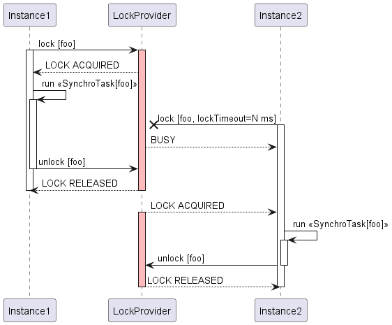

# Synchro Task

[](https://www.apache.org/licenses/LICENSE-2.0.txt)
[](https://maven-badges.herokuapp.com/maven-central/org.vg2902/synchro-task-parent)
[](https://javadoc.io/doc/org.vg2902/synchro-task-parent)

SynchroTask is a lightweight library which helps to synchronize Java routines in distributed environments.

Synchronization is one of the most important parts in software development. 
Programming languages offer a wide range of options to work with locks and concurrency.
In Java, developers can choose between low-level features, such as **synchronized** or methods like Object.wait(), 
and high-level abstractions from **java.util.concurrent.locks**.
However, when it comes to multi-instance environments, these mechanisms are not sufficient.

Sharing locks between different Java virtual machines requires an external agent, 
and **SynchroTask** library is one of those agents.

* [Concepts](#concepts)
  * [SynchroTask](#synchrotask)
  * [SynchroTaskService](#synchrotaskservice)
  * [Lock timeout](#lock-timeout) 
* [Providers](#providers)
  * [JDBC](#jdbc)
  * [Redis](#redis)
* [Lock timeout defaults](#lock-timeout-defaults)
* [Spring integration](#spring-integration)
* [Logging](#logging)
* [Release notes](#release-notes)
  * [0.4.0](#040)
  * [0.3.2](#032)
  * [0.3.1](#031)
  * [0.3.0](#030)
  * [0.2.0](#020)
  * [0.1.0](#010)

## Concepts
The library does not implement any lock primitives on its own. 
Instead, it relies on external lock providers and helps to seamlessly integrate them into your code.  

There are two key abstractions:
* [SynchroTask](synchro-task-core/src/main/java/org/vg2902/synchrotask/core/api/SynchroTask.java) - represents a unit of
work which requires synchronization while executing
* [SynchroTaskService](synchro-task-core/src/main/java/org/vg2902/synchrotask/core/api/SynchroTaskService.java) - 
a service for running `SynchroTask` instances

#### SynchroTask
A **SynchroTask** is uniquely identified by **taskId**.

Once initiated and until completed, a **SynchroTask** instance prevents other instances
with the same **taskId** from being launched in parallel. 
An attempt to start such an instance will be blocked according to the [**lock timeout**](#lock-timeout) settings.
In other words, **SynchroTask** instance **acquires**/**releases** a **lock** upon start/completion respectively.

The workload is provided in the form of `Supplier`, or `Runnable` for the tasks with no return value.

Use builder methods to construct `SynchroTask` objects:

```java
import org.vg2902.synchrotask.core.SynchroTask;

...

SynchroTask<String> synchroTaskFromSupplier = SynchroTask
        .from(() -> "foo")
        .withId("bar")
        .build();

SynchroTask<Void> synchroTaskFromRunnable = SynchroTask
        .from(() -> System.out.println("foo"))
        .withId("bar")
        .build();
```

#### SynchroTaskService
`SynchroTaskService` executes `SynchroTask`s. `run(SynchroTask)` method takes a `SynchroTask` and does all the
work required to run it and ensure synchronization according to the task [**lock timeout**](#lock-timeout) settings.

Check [Providers](#providers) section for the available `SynchroTaskService` implementations.

#### Lock Timeout
A `SynchroTask` can be configured with **lockTimeout** property which indicates the amount of time a `SynchroTaskService`
should wait if the given task can't be started because of the blocking instance running in parallel:



##### Fixed timeout

The simplest way is to specify a timeout as a number of milliseconds:

```java
import org.vg2902.synchrotask.core.SynchroTask;

...

SynchroTask<String> synchroTaskWithLockTimeout = SynchroTask
        .from(() -> "foo")
        .withId("bar")
        .withLockTimeout(60000)
        .build();
```

For zero timeout, you can either provide 0 or use `withZeroLockTimeout()` initializer: 

```java
import org.vg2902.synchrotask.core.SynchroTask;

...

SynchroTask<String> synchroTaskWithZeroLockTimeout = SynchroTask
        .from(() -> "foo")
        .withId("bar")
        .withZeroLockTimeout()
        .build();
```

##### Indefinite timeout

When it is not possible to guess the right timeout, you may use `withMaxSupportedLockTimeout()` initializer. When such 
a task is blocked, the `SynchroTaskService` will wait for it to unblock as long as it is supported by the underlying
lock provider:

```java
import org.vg2902.synchrotask.core.SynchroTask;

...

SynchroTask<String> synchroTaskWithMaxSupportedLockTimeout = SynchroTask
        .from(() -> "foo")
        .withId("bar")
        .withMaxSupportedLockTimeout()
        .build();
```

See [Lock timeout defaults](#lock-timeout-defaults) for the supported lock providers max timeouts.  

##### Default timeout

If the timeout is not specified, the lock provider will use its own default value.
Same behaviour can be achieved by using `withDefaultLockTimeout()` initializer, so that both `SynchroTask`s below are
equivalent:

```java
import org.vg2902.synchrotask.core.SynchroTask;

...

SynchroTask<String> synchroTaskWithDefaultTimeout1 = SynchroTask
        .from(() -> "foo")
        .withId("bar")
        .withDefaultLockTimeout()
        .build();

SynchroTask<String> synchroTaskWithDefaultTimeout2 = SynchroTask
        .from(() -> "foo")
        .withId("bar")
        .build();
```

See [Lock timeout defaults](#lock-timeout-defaults) for the supported lock providers default timeouts.

##### Timeout expiration

By default, `SynchroTaskService.run(SynchroTask)` throws [SynchroTaskCollisionException](synchro-task-core/src/main/java/org/vg2902/synchrotask/core/exception/SynchroTaskCollisionException.java)
if the given `SynchroTask` is blocked and the waiting time exceeds `LockTimeout`.

This behavior can be changed by providing <b>false</b> to `SynchroTask.throwExceptionAfterTimeout(boolean)` initializer.
In this case the task will exit straight after lock timeout and return <b>null</b>. `Runnable`-based tasks will exit
with no return value. 

Example:

```java
import org.vg2902.synchrotask.core.SynchroTask;

...

SynchroTask<String> synchroTaskWithDefaultTimeout1 = SynchroTask
        .from(() -> "foo")
        .withId("bar")
        .withLockTimeout(10000)
        .throwExceptionAfterTimeout(false)
        .build();
```

If the task above is blocked, `SynchroTaskService.run(SynchroTask)` will wait for 10 seconds before returning <b>null</b>.

##### Collision strategy
Previous versions of `SynchroTask` supported `CollisionStrategy` parameter.
Starting from version 0.3.0 it is deprecated and might be removed in the following releases in the favor of 
[**lock timeout**](#lock-timeout). 

The snippets below show equivalent `LockTimeout` configurations for each `CollisionSrategy` value:

###### THROW

```java
import org.vg2902.synchrotask.core.SynchroTask;

...
        
SynchroTask<String> throwingSynchroTask1 = SynchroTask
        .from(() -> "foo")
        .withId("bar")
        .onLock(CollisionStrategy.THROW) //deprecated
        .build();

SynchroTask<String> throwingSynchroTask2 = SynchroTask
        .from(() -> "foo")
        .withId("bar")
        .withZeroLockTimeout() // preferred
        .build();
```

###### RETURN

```java
import org.vg2902.synchrotask.core.SynchroTask;

...

SynchroTask<String> returningSynchroTask1 = SynchroTask
        .from(() -> "foo")
        .withId("bar")
        .onLock(CollisionStrategy.RETURN) //deprecated
        .build();

SynchroTask<String> returningSynchroTask2 = SynchroTask
        .from(() -> "foo")
        .withId("bar")
        .withZeroLockTimeout()             // preferred
        .throwExceptionAfterTimeout(false) // preferred
        .build();
```

###### WAIT

```java
import org.vg2902.synchrotask.core.SynchroTask;

...

SynchroTask<String> returningSynchroTask1 = SynchroTask
        .from(() -> "foo")
        .withId("bar")
        .onLock(CollisionStrategy.WAIT) //deprecated
        .build();

SynchroTask<String> returningSynchroTask2 = SynchroTask
        .from(() -> "foo")
        .withId("bar")
        .withDefaultLockTimeout() // preferred
        .build();
```

## Providers
### JDBC
`SynchroTaskJdbcService` uses a special **registry table** in a database to keep track of running tasks 
and ensure synchronization. 
You can use the SQL below to create it:

#### H2
```iso92-sql
CREATE TABLE synchro_task(
  task_id           VARCHAR2(100 CHAR) NOT NULL
, creation_time     TIMESTAMP(9)
, CONSTRAINT synchro_task_pk PRIMARY KEY (task_id));
```

#### MySQL
```iso92-sql
CREATE TABLE synchro_task(
  task_id           VARCHAR(100) NOT NULL
, creation_time     TIMESTAMP(6)
, CONSTRAINT synchro_task_pk PRIMARY KEY (task_id));
```

#### Oracle
```iso92-sql
CREATE TABLE synchro_task(
  task_id           VARCHAR2(100 CHAR) NOT NULL
, creation_time     TIMESTAMP(9)
, CONSTRAINT synchro_task_pk PRIMARY KEY (task_id));
```

#### PostgreSQL
```iso92-sql
CREATE TABLE synchro_task(
  task_id           VARCHAR(100) NOT NULL
, creation_time     TIMESTAMP(6)
, CONSTRAINT synchro_task_pk PRIMARY KEY (task_id));
```

The table must have:
* both columns with exactly the same names and data types as they are defined above
* a primary key on **task_id** column 

Column size, however, is not limited and can vary. Just make sure that **task_id** column 
is wide enough to fit anticipated values. By default, the service expects the table to be named **SYNCHRO_TASK**, 
but this can be overridden.

`SynchroTaskJdbcService` requires `javax.sql.DataSource` for initialization. 
Every invocation of `run(SynchroTask)` method first obtains a new `Connection` from this `DataSource`. 
This connection is then used to create and immediately lock the **control row** with the given **task_id** in 
the **registry table**. 

If the row already exists and is unlocked, the service will try to reuse it. 
If the row already exists and is locked by another database session, the given `SynchroTask` is assumed 
as being currently executed, and the operation outcome will depend on the task [**lock timeout**](#lock-timeout)
settings.

After successful `SynchroTask` completion, the **control row** will be removed from the table, and the task result will
be returned.

The `Connection` will always be closed before returning from the method.

#### Project dependencies
```xml
<dependency>
    <groupId>org.vg2902</groupId>
    <artifactId>synchro-task-jdbc</artifactId>
    <version>0.4.0</version>
</dependency>
```

#### Usage

```java
import org.vg2902.synchrotask.core.api.SynchroTask;
import org.vg2902.synchrotask.core.api.SynchroTaskService;
import org.vg2902.synchrotask.jdbc.SynchroTaskJdbcService;

import javax.sql.DataSource;

...

DataSource ds = getDataSource();

SynchroTaskService service = SynchroTaskJdbcService
        .from(ds)
        .build;

SynchroTask<Void> noop = SynchroTask
        .from(() -> {})
        .withId("foo")
        .build();

service.run(noop);
```

When creating a `SynchroTaskJdbcService`, you can provide two optional parameters:
* registry table name, defaults to **SYNCHRO_TASK** if not provided
* interceptor, which gets triggered as part of `SynchroTaskJdbcService.run(SynchroTask)` invocations,
  capturing the `SynchroTask` passed in, and `java.sql.Connection` object allocated for it.
  Interceptor is helpful mostly for testing and debugging purposes.
  
```java
import org.vg2902.synchrotask.core.api.SynchroTask;
import org.vg2902.synchrotask.core.api.SynchroTaskService;
import org.vg2902.synchrotask.jdbc.SynchroTaskJdbcService;

import javax.sql.DataSource;
import java.sql.Connection;

...

public void test(DataSource ds) {    
    SynchroTaskService service = SynchroTaskJdbcService
        .from(ds)
        .withTableName("CUSTOM_SYNCHRO_TASK")
        .withInterceptor(this::intercept)
        .build();

    SynchroTask<Void> noop = SynchroTask
        .from(() -> {})
        .withId("foo")
        .build();
    
    service.run(noop);    
}

public void intercept(SynchroTask<?> task, Connection connection) {
    // do something
}
```

#### Requirements
The following databases are currently supported:
* H2
* MySQL
* Oracle
* PostgreSQL

### Redis
Redis support is implemented by `SynchroTaskRedisService`, which relies on [Redisson](https://github.com/redisson/redisson) client.

#### Project dependencies
```xml
<dependency>
    <groupId>org.vg2902</groupId>
    <artifactId>synchro-task-redis</artifactId>
    <version>0.4.0</version>
</dependency>

<dependency>
    <groupId>org.redisson</groupId>
    <artifactId>redisson</artifactId>
    <version>3.19.0</version>
</dependency>
```
#### Usage

```java
import org.redisson.Redisson;
import org.redisson.api.RLock;
import org.redisson.api.RedissonClient;
import org.redisson.config.Config;

import org.vg2902.synchrotask.core.api.SynchroTask;
import org.vg2902.synchrotask.core.api.SynchroTaskService;
import org.vg2902.synchrotask.jdbc.SynchroTaskRedisService;

...

public void test() {
    Config config = new Config();
    config.useSingleServer().setAddress("redis://localhost:6379");
    config.setLockWatchdogTimeout(30000);

    RedissonClient redissonClient = Redisson.create(config);

    SynchroTaskService service = SynchroTaskRedisService
        .from(redissonClient)
        .withInterceptor(this::intercept)
        .build();

    SynchroTask<Void> noop = SynchroTask
        .from(() -> {})
        .withId("foo")
        .build();
    
    service.run(noop);    
}

public void intercept(SynchroTask<?> task, RLock rLock) {
    // do something
}
```

The snippet above shows how to initialize a `SynchroTaskRedisService` which uses a single-server Redis instance running on
localhost at port 6379.

Note how [Watchdog timeout](https://github.com/redisson/redisson/wiki/2.-Configuration#lockwatchdogtimeout) is specified
in order to clean up the locks which are not released gracefully.

## Lock timeout defaults
| Lock Provider type | Lock Provider name | Default lock timeout | Max supported lock timeout | Time unit    |
|--------------------|--------------------| -------------------- | -------------------------- |--------------|
| JDBC               | H2                 | 1000                 | 4294967295                 | milliseconds |
| JDBC               | MySQL              | 50                   | 1073741824                 | seconds      |
| JDBC               | Oracle             | 0                    | N/A                        | N/A          |
| JDBC               | PostgreSQL         | 0                    | 2147483647                 | milliseconds |
| Redis              | Redis              | 0                    | 9223372036854775807        | seconds      |

## Spring integration
With SynchroTask Spring extension, you don't need to construct your tasks manually - just tell Spring which methods should be running as 
<b>SynchroTask</b>s, and the framework will do it for you.

#### Project dependencies
```xml
<dependency>
    <groupId>org.vg2902</groupId>
    <artifactId>synchro-task-spring</artifactId>
    <version>0.4.0</version>
</dependency>
```

#### Usage
Spring setup requires two steps:
* enable **SynchroTask** support at the application level using `@EnableSynchroTask` annotation
* define at least one `SynchroTaskService` bean 
```java
import org.springframework.context.annotation.Bean;
import org.springframework.context.annotation.Configuration;
import org.vg2902.synchrotask.core.api.SynchroTaskService;
import org.vg2902.synchrotask.jdbc.SynchroTaskJdbcService;
import org.vg2902.synchrotask.spring.EnableSynchroTask;

import javax.sql.DataSource;
import java.sql.Connection;

@Configuration
@EnableSynchroTask
public class SynchroTaskConfig {
  
    @Bean
    public SynchroTaskService jdbcSynchroTaskService(DataSource ds) {
        return SynchroTaskJdbcService.from(ds).build();
    }

}
```

Then use `@SynchroTask` annotation to indicate a method that you want to run as a `SynchroTask`.
The framework will wrap the method invocations in individual `SynchroTask` instances 
and execute them with an eligible `SynchroTaskService` bean.

The method must have a `@TaskId`-annotated parameter to designate **taskId** of the resulting `SynchroTask` objects.

Note, that the object containing annotated methods has to be a Spring bean.

```java
import org.vg2902.synchrotask.spring.SynchroTask;
import org.vg2902.synchrotask.spring.TaskId;

@Component
public class SynchroTaskRunner { 
    
    @SynchroTask
    public Integer defaultTask(@TaskId long taskId) {
        return 42;
    }

}
```

`@SynchroTask` without parameters will create `SynchroTask` instances with default [lock timeout](#lock-timeout)
and run them using a primary `SynchroTaskService` bean.

These can be overridden with `serviceName`, `lockTimeout` and `throwExceptionAfterTimeout` parameters:

```java
import org.vg2902.synchrotask.spring.SynchroTask;
import org.vg2902.synchrotask.spring.TaskId;

@Component
public class SynchroTaskRunner { 
    
    @SynchroTask(lockTimeout = 10000, throwExceptionAfterTimeout = false, serviceName = "jdbcSynchroTaskService")
    public Integer throwingTask(@TaskId long taskId) {
        return 42;
    }

}
```

#### Requirements
Spring versions from 3.0.0 and above are supported

## Logging
SynchroTask uses [SLF4J](http://www.slf4j.org/) logging facade.
You can get the most detailed logs by setting `org.vg2902.synchrotask` log level to `DEBUG`.

#### Logback

`logback.xml`:

```xml
<?xml version="1.0" encoding="UTF-8"?>
<configuration>
  <appender name="STDOUT" class="ch.qos.logback.core.ConsoleAppender">
    <encoder>
      <pattern>%d{ISO8601} %-5level [%t] %C{1.}: %msg%n%throwable</pattern>
    </encoder>
  </appender>

  <root level="info">
    <appender-ref ref="STDOUT"/>
  </root>

  <!-- Setting SynchroTask log level to DEBUG -->
  <logger name="org.vg2902.synchrotask" level="debug" additivity="false">
    <appender-ref ref="STDOUT"/>
  </logger>
</configuration>
```

#### Log4j2

`log4j2.xml`:

```xml
<?xml version="1.0" encoding="UTF-8"?>
<Configuration status="info">
  <Appenders>
    <Console name="Console" target="SYSTEM_OUT">
      <PatternLayout pattern="%d{ISO8601} %-5level [%t] %C{1.}: %msg%n%throwable"/>
    </Console>
  </Appenders>

  <Loggers>
    <Root level="info">
      <AppenderRef ref="Console"/>
    </Root>

    <!-- Setting SynchroTask log level to DEBUG -->
    <Logger name="org.vg2902.synchrotask" level="debug" additivity="false">
      <AppenderRef ref="Console"/>
    </Logger>
  </Loggers>
</Configuration>
```

## Known issues and workarounds
### H2 database doubles lock timeout value
There is an open [issue](https://github.com/h2database/h2database/issues/2500) which causes H2 to wait for a specified
timeout twice.

As a workaround, provide a halved lock timeout value

## Release notes
### 0.4.0
* Adding support for Redis
* Discontinuing taskName attribute
### 0.3.2
* Addressing vulnerabilities
  * https://github.com/advisories/GHSA-673j-qm5f-xpv8
### 0.3.1
* Addressing vulnerabilities
  * https://nvd.nist.gov/vuln/detail/CVE-2021-42392
  * https://nvd.nist.gov/vuln/detail/CVE-2022-21724
  * https://nvd.nist.gov/vuln/detail/CVE-2022-23221

### 0.3.1
* Addressing vulnerabilities
  * https://nvd.nist.gov/vuln/detail/CVE-2021-42392
  * https://nvd.nist.gov/vuln/detail/CVE-2022-21724
  * https://nvd.nist.gov/vuln/detail/CVE-2022-23221

### 0.3.0
* JDBC provider now supports MySQL database
* Lock timeout support added
* CollisionStrategy property is deprecated

### 0.2.0
* JDBC provider now supports PostgreSQL database 

### 0.1.0
* Initial release
* JDBC provider with support of Oracle and H2 databases
* Extension for Spring Framework
